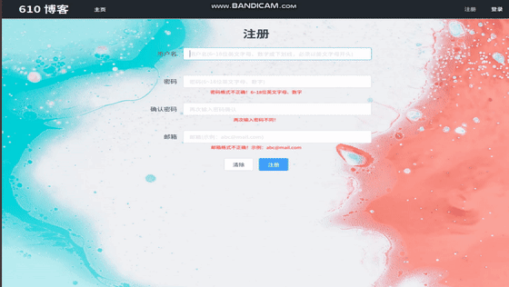
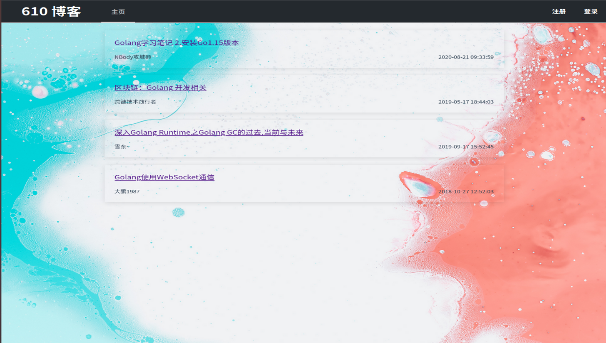
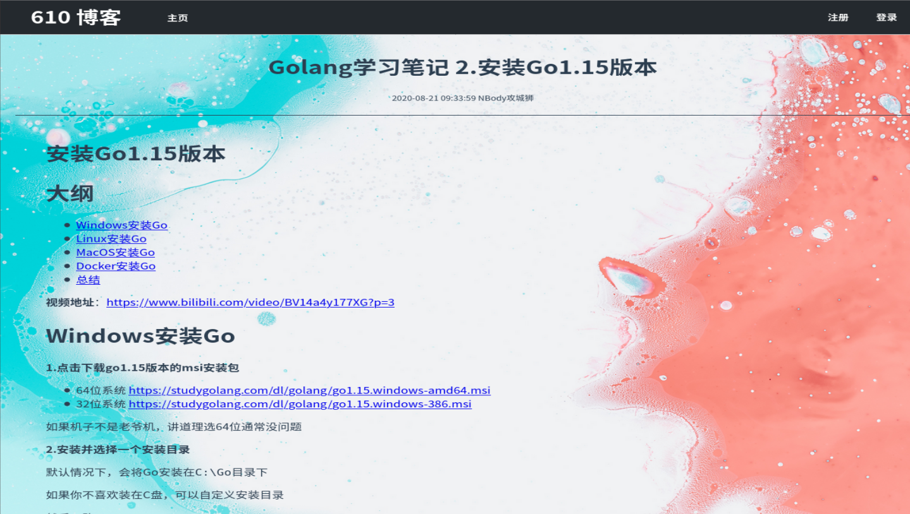
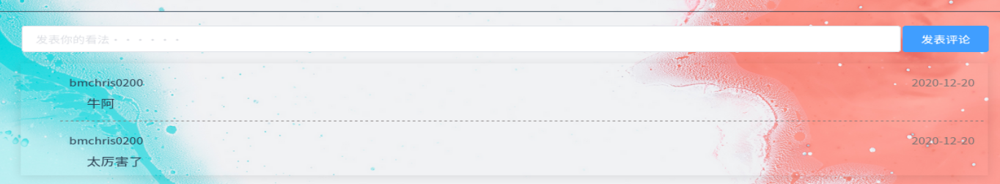
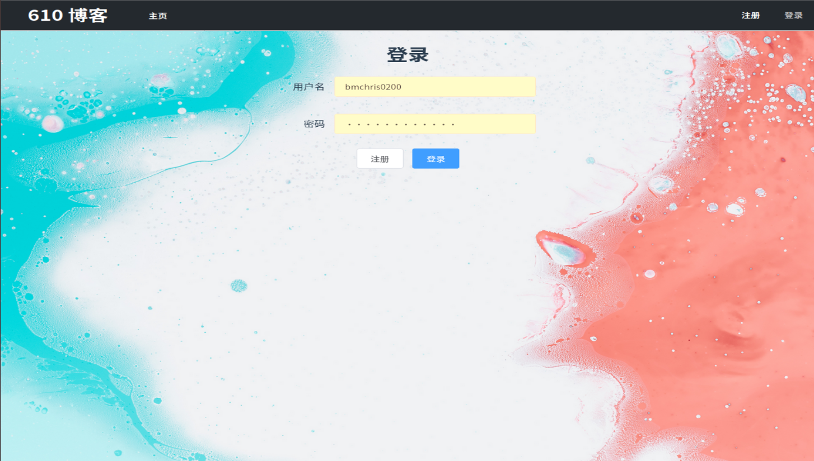
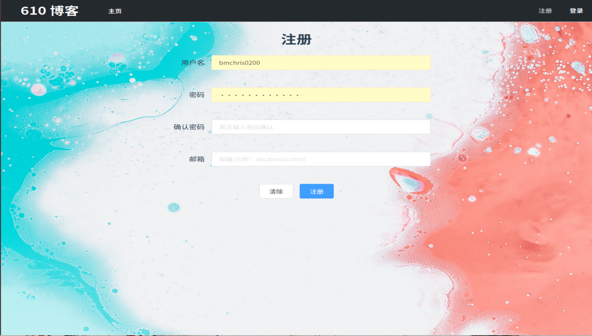

# 项目文档

## 简单 web 服务与客户端开发实战


### 小组成员

|  姓名  |   学号   |                           博客地址                           |
| :----: | :------: | :----------------------------------------------------------: |
| 李研通 | 18342052 | [简单 web 服务与客户端开发实战](https://blog.csdn.net/m0_46493556/article/details/111479559) |
| 刘永祺 | 18342062 | [作业9 简单 web 服务与客户端开发实战](https://gitee.com/liuyq77/service-computing/blob/master/hw9.md) |
| 刘智斌 | 18342063 | [简单 web 服务与客户端开发实战](https://blog.csdn.net/weixin_43958631/article/details/111465998) |
| 龙保宏 | 18342065 | [简单 web 服务与客户端开发实战](https://blog.csdn.net/weixin_43851303/article/details/111499848) |
|        |          |                                                              |

### 项目简介

​	该项目是我们小组合作完成的一个简单的博客页面，可以注册并登录用户，并且实现了博客地下的评论功能。

以注册用户为例，其代码如下：

```go
func UserRegisterPost(w http.ResponseWriter, r *http.Request) {

	db.Init()

	var user model.User

	err := json.NewDecoder(r.Body).Decode(&user)
	if err != nil {
		Response(MyResponse{
			nil,
			"parameter error",
		}, w, http.StatusBadRequest)
		return
	}

	check := db.GetUser(user.Username)

	if check.Username != "" {
		Response(MyResponse{
			nil,
			"username existed",
		}, w, http.StatusBadRequest)
		return
	}

	err = db.PutUsers([]model.User{user})

	if err != nil {
		Response(MyResponse{
			nil,
			err.Error(),
		}, w, http.StatusBadRequest)
		return
	}
	tokenString, err := SignToken(user.Username)
	if err != nil {
		w.WriteHeader(http.StatusInternalServerError)
		fmt.Fprintln(w, "Error while signing the token")
		tokenString = "signing token error"
	}
	Response(MyResponse{
		tokenString,
		nil,
	}, w, http.StatusOK)

}
```

效果如图：



### API说明

我们实现了四种资源类型

```go
package model
type Article struct {
	Id int64 `bson:"id" json:"id,omitempty"`
	Title string `bson:"title" json:"title,omitempty"`
	Username string `bson:"username" json:"username,omitempty"`
	Tags []Tag `bson:"tags" json:"tags,omitempty"`
	Date string `bson:"date" json:"date,omitempty"`
	Content string `bson:"content" json:"content,omitempty"`
	Comments []Comment `bson:"comments" json:"comments,omitempty"`
}

type Comment struct {
	User string `bson:"user" json:"user,omitempty"`
	ArticleId int64 `bson:"article_id" json:"article_id,omitempty"`
	Date string `bson:"date" json:"date,omitempty"`
	Content string `bson:"content" json:"content,omitempty"`
}

type Tag struct {
	Id int64 `bson:"id" json:"id,omitempty"`
	Name string `bson:"name" json:"name,omitempty"`
}

type User struct {
	Username string `bson:"username" json:"username,omitempty"`
	Password string `bson:"password" json:"password,omitempty"`
}

```

实现了以下API

```go
GET /article/{id}/comments		//获取博客评论
GET /article/{id} 				//根据id获取博客
GET /articles					//获取所有博客
POST /article/{id}/comments 	//发表评论
POST /user/login 				//登录用户
POST /user/register 			//注册用户
```


### 资源来源

主页示例上的四篇博客分别来源于：

[Golang学习笔记 2.安装Go1.15版本](https://blog.csdn.net/weixin_44087733/article/details/108140514)

[区块链：Golang 开发相关](https://blog.csdn.net/shangsongwww/article/details/90298702)

[深入Golang Runtime之Golang GC的过去,当前与未来](https://blog.csdn.net/weixin_39998006/article/details/100928939)

[Golang使用WebSocket通信](https://blog.csdn.net/yjp19871013/article/details/83444148)


### 安装指南

#### 前端安装

首先需要安装npm的镜像文件，否则在下面步骤会卡住（如已安装可跳过）。

```
npm i -g cnpm --registry=https://registry.npm.taobao.org
```

然后下载前端文件夹，安装依赖项

```
cnpm install
```

在8080端口打开前端

```
cnpm run dev
```

#### 后端安装

1. 启动 `mongoDB`（需要提前安装），创建数据库 `Articles`，并在该数据库中创建collection：`ArticleData`和`Users`，然后创建一个具有读写权限的用户，用户名`service_test`，密码`123456`
2. 在cmd运行以下命令 `go get -v github.com/610Masters/Backend`
3. 3.在文件夹内运行以下命令 `go run main.go`

### 加分项

本项目采用了jwt实现了token认证，详情见[刘智斌的博客](https://blog.csdn.net/weixin_43958631/article/details/111465998)

### 效果展示

主页页面：



博客页面：



评论区：



登录页面：



注册页面:

